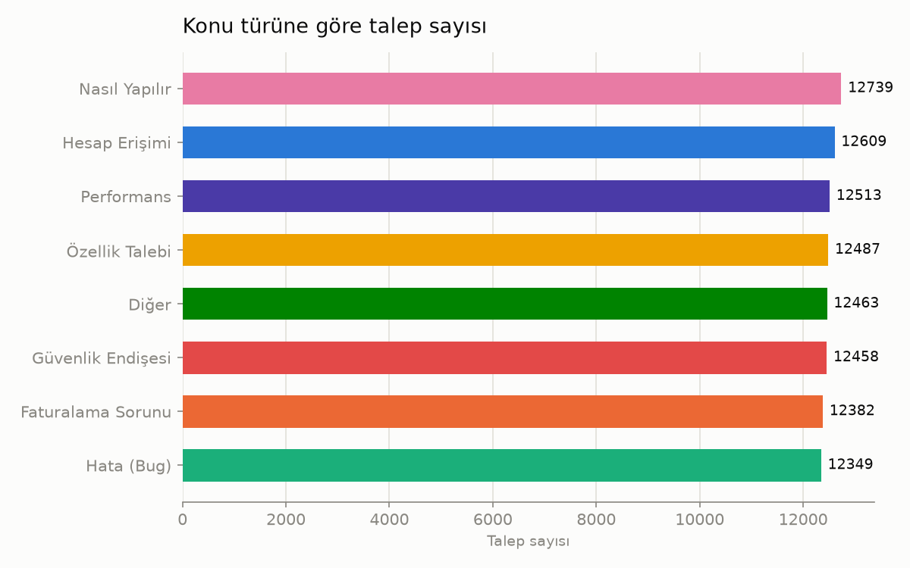
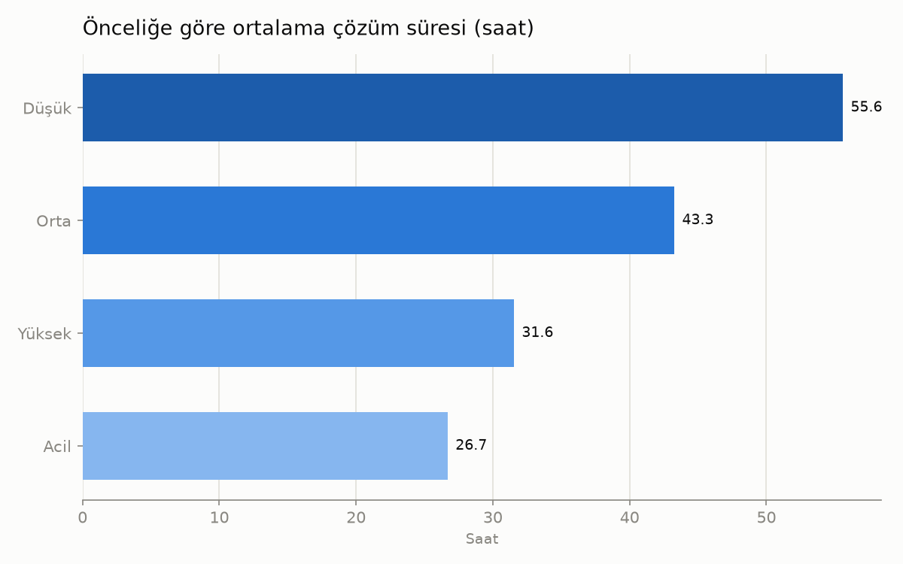
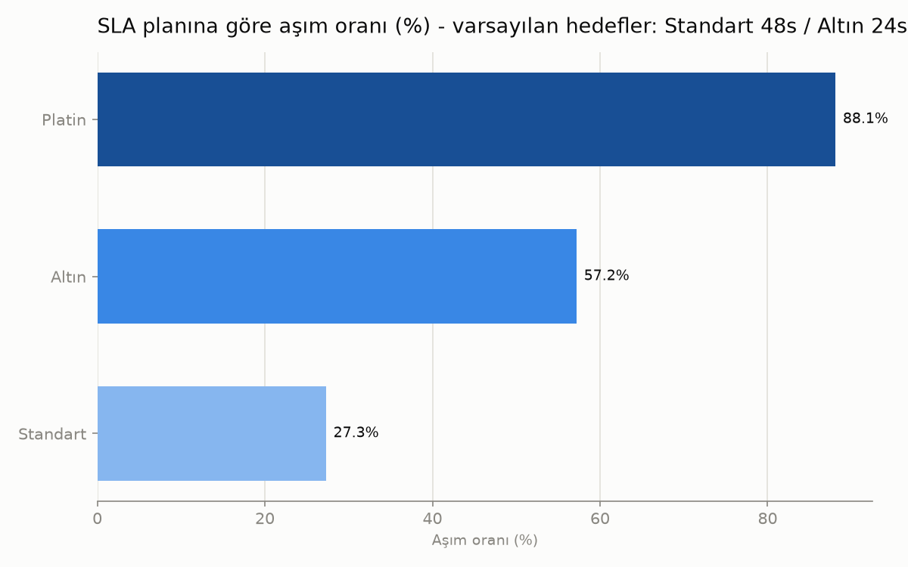
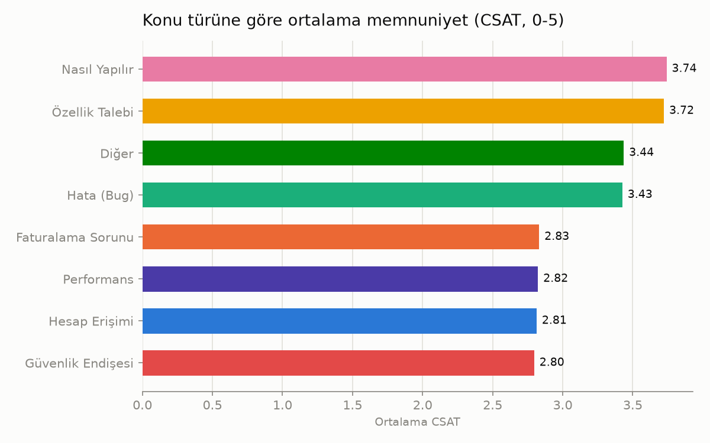
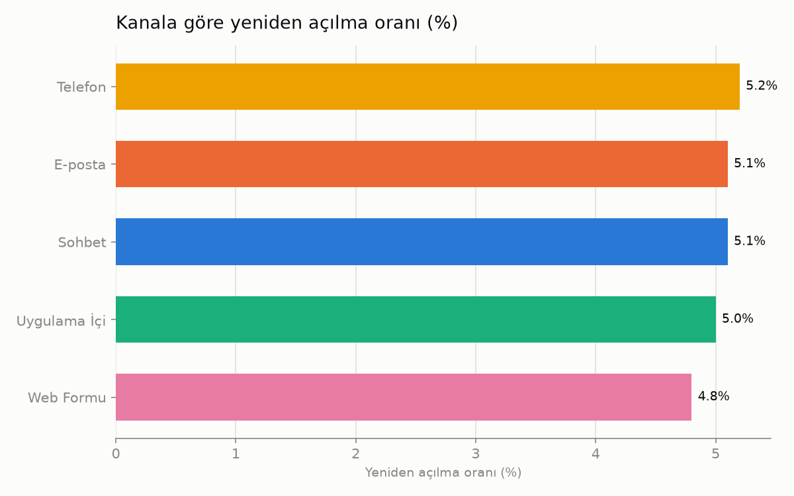

# IT Helpdesk Ticket Analytics & Mini Dashboard

Bir BT (IT) destek biriminin açtığı ticket'ları (destek taleplerini) analiz eden
uçtan uca küçük bir veri analizi / iş zekası (BI) projesi. Amaç: gerçek bir
Business Analyst / Veri Analisti işinin küçük ölçekli bir simülasyonunu yaparak
GitHub portföyünde öne çıkan bir proje ortaya koymak.

## Neden bu proje?

- IT Destek geçmişiyle doğrudan örtüşüyor (ticket/incident takibi).
- Business Analyst hedefine uygun: veriden iş kararına giden yol gösteriliyor.
- Python + MySQL + SQL + görselleştirme becerilerinin hepsini bir arada kullanıyor.

## İş soruları

1. Hangi konu türünde (`issue_type` / `product_area`) en çok ticket açılıyor?
2. Ortalama çözüm süresi (`resolution_time_hours`) önceliğe ve konu türüne göre nasıl değişiyor?
3. `sla_plan`'a göre (standard/gold/platinum) SLA aşım oranı nedir?
4. Müşteri memnuniyeti (`csat_score`) ve duygu durumu (`customer_sentiment`) hangi konu türlerinde en düşük?
5. Hangi kanaldan (`channel`) gelen ticket'lar daha sık yeniden açılıyor (`reopened`)?

## Klasör yapısı

```
it-helpdesk-analytics/
├── data/          # Ham ve temizlenmiş veri (büyük dosyalar .gitignore ile hariç tutulur)
├── sql/           # MySQL şema ve analiz sorguları
├── src/           # Python script'leri (veri temizleme, yükleme, dashboard)
├── dashboard/     # Üretilen grafikler
├── requirements.txt
└── README.md
```

## Teknoloji

- Python (pandas, matplotlib, sqlalchemy)
- MySQL
- Git / GitHub

## Kullanılan yetkinlikler

- Veri temizleme ve doğrulama (eksik değer analizi, mantıklı/mantıksız eksiklik ayrımı)
- İlişkisel veritabanı şema tasarımı (MySQL)
- Python'dan MySQL'e veri aktarımı (ETL - pandas + SQLAlchemy)
- İş sorularını SQL sorgularına çevirme (GROUP BY, agregasyon, CASE WHEN)
- Varsayımları açıkça belirtme ve bunların sonuçlara etkisini yorumlama (SLA eşiği örneği)
- Veri görselleştirme (matplotlib, erişilebilir renk paleti ilkeleri)

## Nasıl çalıştırılır

1. Depoyu klonlayın ve proje klasörüne girin
2. Sanal ortam oluşturup aktif edin: `python -m venv .venv` sonra `.venv\Scripts\Activate.ps1` (Windows) ya da `source .venv/bin/activate` (Mac/Linux)
3. Bağımlılıkları kurun: `pip install -r requirements.txt`
4. [Kaggle - Synthetic IT Support Tickets](https://www.kaggle.com/datasets/ahsanneural/synthetic-it-support-tickets) veri setini indirip `data/raw_tickets.csv` olarak kaydedin
5. MySQL'de şemayı oluşturun: `mysql -u root -p < sql/schema.sql`
6. `.env.example` dosyasını `.env` olarak kopyalayıp kendi MySQL bilgilerinizi girin
7. Sırayla çalıştırın:
   ```
   python src/clean_data.py
   python src/load_to_mysql.py
   python src/build_dashboard.py
   ```

## Veri seti

Kaynak: [Synthetic IT Support Tickets (Kaggle)](https://www.kaggle.com/datasets/ahsanneural/synthetic-it-support-tickets)
Yerel konum: `data/raw_tickets.csv` (yaklaşık 33 MB, git'e dahil değil — bkz. `.gitignore`)

## Bulgular

`sql/analysis_queries.sql` dosyasındaki sorguların sonuçlarına dayanan öne çıkan bulgular:

- **Konu dağılımı dengeli:** 8 `issue_type` kategorisi de birbirine yakın oranlarda (%12-13 civarı), tek bir kategori baskın değil.
- **Öncelik mantığı tutarlı çalışıyor:** `low` öncelikli ticket'lar ortalama 55-56 saatte, `medium` öncelikliler 42-44 saatte çözülüyor — yüksek öncelik daha hızlı çözülüyor, beklenen davranış bu.
- **SLA aşım oranı, seçilen eşiğe çok duyarlı:** `platinum` planda (8 saatlik hedefle) aşım oranı %88.1 iken `standard` planda (48 saatlik hedefle) %27.3. Daha sıkı bir hedef doğal olarak daha yüksek aşım oranına yol açıyor — "aşım oranı" tek başına yanıltıcı olabilir, hangi eşiğe göre hesaplandığı mutlaka belirtilmeli.
- **Müşteri memnuniyeti konu türüne göre net biçimde ayrışıyor:** `security_concern`, `account_access`, `performance`, `billing_problem` gibi temel işlevi bozan sorunlarda ortalama CSAT ~2.8; `bug`, `feature_request`, `how_to` gibi konularda ~3.4-3.74. Temel erişim/güvenlik/fatura sorunları müşterileri çok daha fazla rahatsız ediyor.
- **Kanal, ticket'ın tekrar açılma oranını anlamlı şekilde etkilemiyor:** tüm kanallarda %4.8-5.2 arası, aralarında belirgin bir fark yok.

## Görselleştirmeler







*(Bu grafikler `src/build_dashboard.py` ile MySQL'deki veriden otomatik üretiliyor.)*
